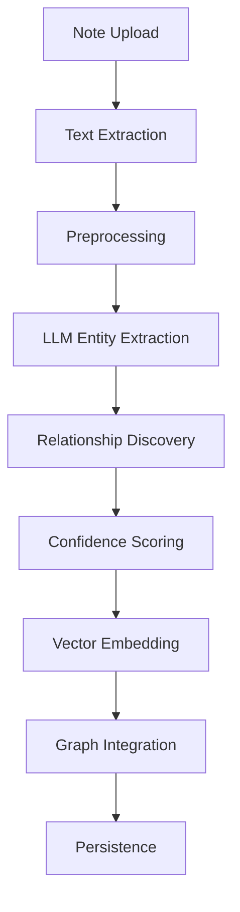
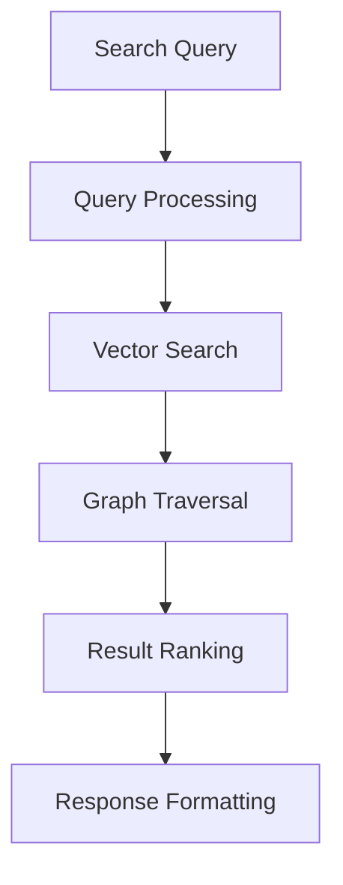
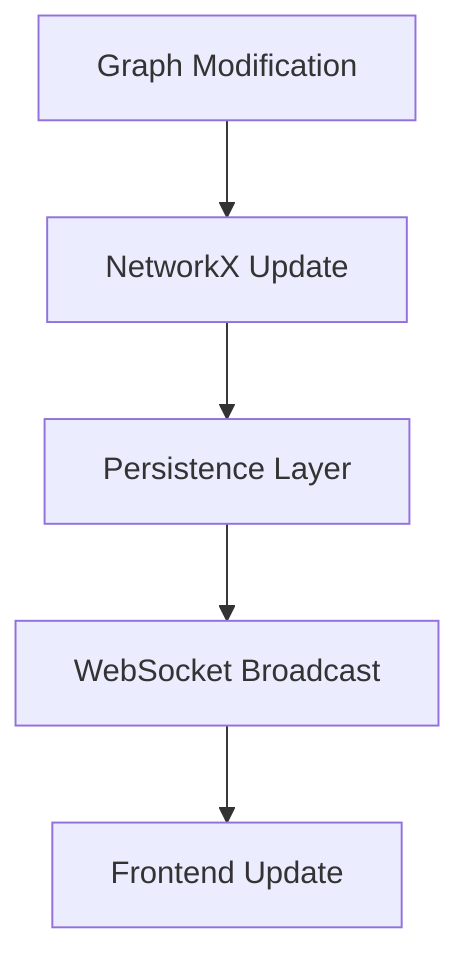

# Architecture Documentation

This document describes the system architecture for Mind Map AI, a local LLM-powered personal knowledge graph system.

## System Overview

Mind Map AI is designed as a distributed system with clear separation of concerns, emphasizing local processing, data privacy, and modular extensibility.

## Technology Stack Rationale

**Frontend (Next.js + React)**: Provides modern, responsive UI with built-in server-side rendering for fast initial page loads. Large ecosystem of visualization libraries (e.g., react-cytoscapejs for graph rendering) and excellent developer experience with TypeScript support. Runs entirely locally with `next dev`, fitting the "everything local" requirement.

**Backend (FastAPI + Python)**: Lightweight async web framework built on Starlette, excellent for building REST APIs with automatic OpenAPI documentation. First-class async support crucial for LLM inference calls. Python's rich ecosystem provides access to NetworkX, sentence-transformers, and vector databases without needing complex integration layers.

**Database (SQLite)**: Embedded, file-based database ensuring local data sovereignty. ACID compliance for reliable transactions, no server process needed, and excellent performance for metadata and provenance queries. Single-file deployment simplifies backup and portability.

**Graph Engine (NetworkX)**: Pure Python implementation with comprehensive graph algorithms. Flexible node/edge attribute storage supporting complex knowledge graph requirements. Built-in persistence options (gpickle for speed, GraphML for interchange) avoid external dependencies.

**Vector Storage (Chroma/Local Faiss)**: Local vector database for semantic search. No cloud dependency, supports high-dimensional embeddings from local models. Chroma provides metadata filtering and hybrid search capabilities, while FAISS offers raw speed for similarity calculations.

**LLM Runtime (Ollama)**: Makes local LLM inference accessible via HTTP API. Supports multiple models (Llama, Mistral, etc.) with simple installation. Alternative runtimes like llama.cpp can be swapped in via configuration if needed.

**Embeddings (sentence-transformers)**: Local sentence embedding models provide semantic understanding without API calls. "all-MiniLM" models offer good balance of quality and computational efficiency for local hardware.

This stack achieves the "all local" constraint while providing production-ready performance, extensibility, and developer ergonomics.

## Embeddings & Vector Search

### Architecture

The system uses a two-tier embedding strategy:

1. **Note Embeddings**: Full note content is embedded for semantic document search
2. **Node Embeddings**: Individual node labels are embedded for entity-level search

### Technology Stack

- **Embedding Model**: sentence-transformers (`all-MiniLM-L6-v2`)
  - Dimension: 384
  - Fast inference on CPU
  - Good balance of speed and quality

- **Vector Store**: ChromaDB with DuckDB+Parquet backend
  - Persistent local storage
  - Efficient similarity search
  - No external dependencies

### Workflow

```
[New Note] → [Extract Text] → [Generate Embedding] → [Index in ChromaDB]
                                                            ↓
[User Query] → [Generate Query Embedding] → [Similarity Search] → [Ranked Results]
```

### Search Process

1. User submits search query
2. Query is embedded using same model
3. Vector similarity (cosine) computed against indexed vectors
4. Results ranked by similarity score (0-1)
5. Top-k results returned with metadata

### Performance Considerations

- Embedding generation: ~50ms per note on CPU
- Search latency: <100ms for 10k vectors
- Index persistence: Automatic on collection update

## High-Level Architecture

```
┌─────────────────────────────────────────────────────────────────┐
│                          Mind Map AI                           │
├─────────────────────────────────────────────────────────────────┤
│                                                                 │
│  ┌─────────────┐  ┌─────────────┐  ┌─────────────┐              │
│  │   Frontend  │  │   Backend   │  │  Local LLM  │              │
│  │   (Next.js) │◄►│  (FastAPI)  │◄►│ (Ollama)   │              │
│  └─────────────┘  └─────────────┘  └─────────────┘              │
│                                                                 │
│  ┌─────────────┐  ┌─────────────┐  ┌─────────────┐              │
│  │  Graph DB   │  │   Vector    │  │   File      │              │
│  │ (NetworkX)  │  │    DB       │  │  Storage    │              │
│  │             │  │ (Chroma)    │  │             │              │
│  └─────────────┘  └─────────────┘  └─────────────┘              │
│                                                                 │
└─────────────────────────────────────────────────────────────────┘
```

## Component Architecture

### 1. Frontend Layer (Next.js)

**Purpose**: User interface and graph visualization
**Location**: `/frontend/`
**Technologies**: Next.js 14, React, TypeScript, Cytoscape.js

**Key Components**:
- **Graph Visualization**: Interactive cytoscape.js-based graph renderer
- **Note Upload Interface**: Drag-and-drop file upload with progress tracking
- **Search Interface**: Semantic and keyword-based search with autocomplete
- **Settings Panel**: Configuration management for LLM and processing parameters

**Data Flow**:
```
User Interaction → React Components → API Client → FastAPI Backend
Graph Updates ← WebSocket ← Real-time Updates ← Backend Processing
```

### 2. Backend Layer (FastAPI)

**Purpose**: API services, business logic, and data processing
**Location**: `/backend/`
**Technologies**: FastAPI, SQLAlchemy, NetworkX, SQLite

**Key Modules**:
- **API Layer** (`/app/api/`): REST endpoints and request/response handling
- **Core Services** (`/app/core/`): Business logic and orchestration
- **Data Models** (`/app/models/`): Database schemas and graph models
- **Database Layer** (`/app/db/`): Database connections and queries

**Data Flow**:
```
HTTP Requests → FastAPI Routes → Service Layer → Database/Vector Store
LLM Processing ← Entity Extraction ← Note Processing Pipeline
Graph Updates → NetworkX Engine → Persistence Layer
```

### 3. Data Storage Layer

#### Graph Storage (NetworkX)
- **Format**: In-memory NetworkX graphs with disk persistence
- **Serialization**: `.gpickle` for full graph state, GraphML for interoperability
- **Location**: `/data/graphs/`
- **Backup Strategy**: Automatic versioning and rollback capabilities

#### Vector Storage (Chroma/Faiss)
- **Purpose**: Semantic search and similarity matching
- **Embeddings**: Sentence-transformers with local models
- **Location**: `/data/embeddings/`
- **Indexing**: FAISS for fast similarity search, Chroma for metadata management

#### Metadata Storage (SQLite)
- **Purpose**: Note provenance, entity metadata, processing history
- **Schema**: Normalized relational structure for efficient querying
- **Location**: `/data/metadata.db`
- **Features**: ACID compliance, foreign key constraints, indexing

### 4. LLM Integration Layer

**Purpose**: Knowledge extraction and natural language processing
**Technologies**: Ollama, Llama.cpp, sentence-transformers

**Components**:
- **Entity Extractor**: Identifies named entities (PERSON, ORG, LOCATION, etc.)
- **Relationship Extractor**: Discovers connections between entities
- **Text Embedder**: Creates vector representations for semantic search
- **Confidence Scorer**: Provides reliability metrics for extractions

**Processing Pipeline**:
```
Raw Text → Text Preprocessing → LLM Entity Extraction → Relationship Discovery
→ Confidence Scoring → Vector Embedding → Graph Integration → Persistence
```

## Data Flow Architecture

### Note Processing Flow


### Search Flow


### Real-time Updates Flow


## Deployment Architecture

### Local Deployment
- **Single Machine**: All components run on user's local machine
- **Resource Requirements**: 8GB+ RAM, modern CPU with AVX support
- **Storage**: Local filesystem with configurable paths
- **Network**: Localhost-only communication

### Docker Deployment (Optional)
- **Containerization**: Separate containers for frontend, backend, and LLM services
- **Orchestration**: Docker Compose for local development
- **Volumes**: Persistent storage for graphs and embeddings

## Security Architecture

### Local-Only Design
- **No External APIs**: All processing happens locally
- **Data Sovereignty**: Complete user control over data
- **Optional Encryption**: Graph and embedding encryption at rest
- **Access Control**: Future authentication and authorization

### Privacy Considerations
- **GDPR Compliance**: Local processing ensures data privacy
- **No Telemetry**: Zero tracking or analytics collection
- **User Consent**: Clear data usage and storage policies

## Performance Architecture

### Caching Strategy
- **LLM Results**: Cache entity and relationship extractions
- **Vector Search**: FAISS indexing for sub-second similarity search
- **Graph Queries**: In-memory NetworkX operations with disk fallback

### Scalability Considerations
- **Graph Size**: Support for graphs with 10,000+ nodes
- **Concurrent Users**: Single-user design (local installation)
- **Processing Queue**: Asynchronous note processing pipeline

## Error Handling Architecture

### Error Types
- **Validation Errors**: Input validation and sanitization
- **Processing Errors**: LLM and extraction failures
- **Storage Errors**: Database and filesystem issues
- **Network Errors**: API and WebSocket failures

### Recovery Mechanisms
- **Graceful Degradation**: Continue operation with reduced functionality
- **Retry Logic**: Exponential backoff for transient failures
- **Fallback Options**: Alternative processing methods when primary fails

## Monitoring and Observability

### Logging Strategy
- **Structured Logging**: JSON format with consistent schema
- **Log Levels**: DEBUG, INFO, WARN, ERROR, CRITICAL
- **Log Rotation**: Size and time-based rotation policies

### Metrics Collection
- **Performance Metrics**: Processing time, memory usage, graph statistics
- **Error Rates**: Track and alert on error patterns
- **Usage Statistics**: Feature usage and user behavior (privacy-focused)

## Future Architecture Considerations

### Extensibility
- **Plugin Architecture**: Support for custom extractors and processors
- **API Extensions**: Webhook and integration capabilities
- **Storage Backends**: Pluggable storage interface

### Multi-modal Support
- **Document Types**: PDF, images, audio, video processing
- **Advanced ML**: Computer vision and speech recognition integration
- **Cross-modal Search**: Search across different content types

This architecture provides a solid foundation for a privacy-focused, extensible knowledge graph system while maintaining performance and usability.
